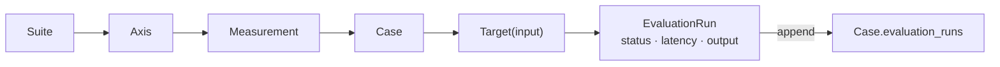

# LLM Application Evaluation

Each case belongs to exactly one axis–measurement pair. Call its application
target and append every completed attempt to `Case.evaluation_runs`, preserving
failures when retrying. Counts follow from that history. Each run records its
status and latency; nested output remains application-defined.



## Evaluation Suite

The suite is an ownership tree:

```text
Evaluation Suite
  Axis
    Measurement
      Case
        Evaluation Run
```

An **Axis** groups related concerns. A **Measurement** names one criterion. Each
**Case** measures exactly one axis–measurement pair and owns all its attempts. A
retry adds a run; a successful retry preserves earlier failures.

### Ownership constraints

- Each case belongs to exactly one measurement within exactly one axis. Its ID
  is unique across the suite, and its runs evaluate only that pair.
- A corpus example can supply inputs to different cases. Each case has a
  distinct ID, its own criterion, and an independent run history. Cases and runs
  are never shared across measurements or axes.
- Each run names its owning case. Its ID is unique across the suite. Adding the
  same run twice, or attaching it to another case, is invalid.
- Axis IDs are unique within a suite; measurement IDs are unique within an axis.
  Reject unknown corpus references before execution.
- A case's axis–measurement assignment stays fixed during evaluation. Changing
  the criterion requires a new case with a new history.

The models below enforce ownership when constructing a suite and when appending
runs. `EvaluationRun` is defined in Evaluation Output below.

```python
from __future__ import annotations

from typing import Annotated, Self

from pydantic import BaseModel, ConfigDict, Field, model_validator


type NonBlankText = Annotated[str, Field(pattern=r"\S")]


class EvaluationModel(BaseModel):
    """Immutable evaluation model with explicit fields and strict values."""

    model_config = ConfigDict(frozen=True, strict=True, extra="forbid")


class Case[Output](EvaluationModel):
    """One criterion-specific case and its recorded attempts."""

    id: NonBlankText
    """Evaluation case ID, for example `reply-contribution-01`."""
    example_id: NonBlankText
    """Corpus input reference, for example `reply-fixed-01`."""
    evaluation_runs: tuple[EvaluationRun[Output], ...]
    """Completed attempts in recording order; initially an empty tuple."""


class Measurement[Output](EvaluationModel):
    """One criterion and the cases that measure it."""

    id: NonBlankText
    """Criterion ID, for example `contribution`."""
    cases: Annotated[tuple[Case[Output], ...], Field(min_length=1)]
    """Cases owned exclusively by this measurement."""


class Axis[Output](EvaluationModel):
    """A group of related measurements."""

    id: NonBlankText
    """Concern ID, for example `reply`."""
    measurements: Annotated[
        tuple[Measurement[Output], ...], Field(min_length=1)
    ]
    """Criteria in this axis, for example Contribution and Grounding."""


class EvaluationSuite[Output](EvaluationModel):
    """Coverage and run histories with unique case and run ownership."""

    id: NonBlankText
    """Suite identifier, for example `chat`."""
    axes: Annotated[tuple[Axis[Output], ...], Field(min_length=1)]
    """Suite concerns, for example reply and personality."""

    @model_validator(mode="after")
    def _ownership_is_unique(self) -> Self:
        axis_ids: set[str] = set()
        case_ids: set[str] = set()
        run_ids: set[str] = set()
        for axis in self.axes:
            if axis.id in axis_ids:
                raise ValueError("axis IDs must be unique within a suite")
            axis_ids.add(axis.id)
            measurement_ids: set[str] = set()
            for measurement in axis.measurements:
                if measurement.id in measurement_ids:
                    raise ValueError("measurement IDs must be unique per axis")
                measurement_ids.add(measurement.id)
                for case in measurement.cases:
                    if case.id in case_ids:
                        raise ValueError("a case must have exactly one owner")
                    case_ids.add(case.id)
                    for run in case.evaluation_runs:
                        if run.case_id != case.id:
                            raise ValueError("run belongs to a different case")
                        if run.id in run_ids:
                            raise ValueError(
                                "a run must have exactly one owner"
                            )
                        run_ids.add(run.id)
        return self

    def append_run(self, run: EvaluationRun[Output]) -> Self:
        """Return a validated snapshot with one attempt added to its case."""
        data = self.model_dump(mode="python", round_trip=True)
        for axis in data["axes"]:
            for measurement in axis["measurements"]:
                for case in measurement["cases"]:
                    if case["id"] == run.case_id:
                        case["evaluation_runs"] = (
                            *case["evaluation_runs"],
                            run.model_dump(mode="python", round_trip=True),
                        )
                        return type(self).model_validate(data)
        raise ValueError(f"unknown case: {run.case_id}")
```

Record through `suite = suite.append_run(run)`. Cases and histories are
immutable, so callers cannot append directly to a leaf and bypass the suite's
ownership checks. The method revalidates the complete tree and preserves the
previous snapshot. Loading a saved suite runs the same ownership validation.

### TODO: `append_run` drops output types

`append_run` dumps the whole suite to a dict and revalidates it. On an
unparameterized `EvaluationSuite`, `Output` is `Any`, so a `BaseModel` output
comes back as a plain `dict` with no error; `EvaluationSuite[Out]` keeps it. It
also re-serializes and revalidates every earlier run on each append.

Replace the round trip by rebuilding only the path to the matching case with
`model_copy(update=...)`, then constructing `type(self)(id=..., axes=...)` so
`_ownership_is_unique` still runs. Add a test that appends a run with a
`BaseModel` output to an unparameterized suite and checks the output's type.

Derive counts from `evaluation_runs`: total attempts are the sequence length;
succeeded and failed attempts are counts of their respective statuses. A
measurement sums its cases, and an axis sums its measurements. Ownership is
exclusive, so no deduplication or separately maintained counters are needed.

### Example: coverage from Love

This suite uses one conversation from
[Love's chat corpus](../love/server/chat/evals/eval-set.json) as input to two
independent cases. Each case measures one criterion and records its own runs.

```json
{
  "id": "chat",
  "axes": [
    {
      "id": "reply",
      "measurements": [
        {
          "id": "contribution",
          "cases": [
            {
              "id": "reply-contribution-01",
              "example_id": "reply-fixed-01",
              "evaluation_runs": []
            }
          ]
        },
        {
          "id": "grounding",
          "cases": [
            {
              "id": "reply-grounding-01",
              "example_id": "reply-fixed-01",
              "evaluation_runs": []
            }
          ]
        }
      ]
    }
  ]
}
```

## Evaluation Target

A target executes one complete attempt and returns a run record. The caller
appends that record before deciding whether to retry:

```python
from collections.abc import Awaitable, Callable


type EvaluationTarget[Input, Output] = Callable[
    [Input], Awaitable[EvaluationRun[Output]]
]
```

Bind each target to its evaluation case. The application resolves `example_id`
to its corpus input and supplies the criterion associated with that case.
Generation can produce a rich response; any review of the run measures only its
owning axis–measurement pair.

The callable stays outside the serialized suite. It can invoke a local service,
an HTTP endpoint, or several model calls. The application owns client setup and
cleanup, authentication, timeouts, internal retries, and conversation state.

Each complete-case retry gets a new run ID and starts with fresh state. Keep the
input, selected variant, and random seed fixed when retrying. Internal provider
retries remain part of one target invocation and its latency.

Expected service failures become failed runs, with partial evidence when
available. A valid refusal is a succeeded run: execution success means obtaining
valid output, independently of whether it passes the measurement. Unexpected
programming errors propagate and stop evaluation.

### Example: taro target

Love's [taro runner](../love/server/taro/evals/evaluation/evaluate.py) calls
`run_reading(...)` once per authored reading. Its existing case helper records a
reading, rejection, or known failure with duration. This adapter binds that
helper to one evaluation case; it belongs in Love.

```python
from uuid import uuid4

from taro.evals.evaluation.evaluate import _run_case as run_taro_case
from taro.evals.evaluation.types import (
    EvaluationCase as TaroCase,
    EvaluationCaseResult as TaroResult,
)
from taro.service import TaroReadingService


def make_taro_target(
    reader: TaroReadingService, *, case: Case[TaroResult]
) -> EvaluationTarget[TaroCase, TaroResult]:
    async def target(input: TaroCase) -> EvaluationRun[TaroResult]:
        if input.id != case.example_id:
            raise ValueError("input does not match the evaluation case")
        result = await run_taro_case(reader=reader, case=input)
        return EvaluationRun[TaroResult](
            id=str(uuid4()),
            case_id=case.id,
            variant_id=None,
            status="failed" if result.failure is not None else "succeeded",
            latency=Latency(seconds=result.duration_seconds),
            output=result,
            error=(
                result.failure.message if result.failure is not None else None
            ),
        )

    return target
```

After selecting a case, construct `target = make_taro_target(reader, case=case)`
and record with `suite = suite.append_run(await target(case_input))`.

### Example: chat and safety targets

Love's [chat runner](../love/server/chat/evals/evaluation/evaluate.py) calls
`ChatService.reply(...)` across ordered turns, sometimes selecting a generated
follow-up. Its input includes a conversation and personality; its output retains
completed turns even if a later turn fails.

Use the same adapter pattern around chat's `_run_case`: bind the evaluation
case, preserve its ID in the returned run, set `variant_id` to the personality,
and map the helper's duration and failure into run metadata. Construct a fresh
service/session store and a selector with the original seed before retrying the
whole case. Multiple turns remain one attempt.

Love's [safety runner](../love/server/safety/evals/evaluate.py) calls
`SafetyService.assess(...)` once per example with fixed text and history. Wrap
its `SafetyExampleResult` in a run: an assessment error is `failed`, while
either valid decision is `succeeded`. It generates no reply or guidance.

## Evaluation Output

`EvaluationRun[Output]` is the root object for one attempt. It contains a
`latency: Latency` field; its `output` contains the application's evidence.
Latency measures the entire target invocation, including internal calls and
retries, for both succeeded and failed attempts. Use a monotonic clock such as
`perf_counter()` when the application does not already measure that boundary.

Keep latency off `EvaluationModel`. Nested output types inherit that base or use
existing application models. Only the run root uses `EvaluationRun`, so the
shared latency field is never injected into middle or leaf objects.

```python
from typing import Literal

from pydantic import FiniteFloat


class Latency(EvaluationModel):
    """Elapsed wall-clock time for one complete evaluation attempt."""

    seconds: Annotated[FiniteFloat, Field(ge=0)]
    """Finite non-negative duration, for example 2.5 seconds."""


class EvaluationRun[Output](EvaluationModel):
    """Immutable root record owned by exactly one evaluation case."""

    id: NonBlankText
    """Unique attempt identifier, for example a UUID."""
    case_id: NonBlankText
    """Owning evaluation case, for example `reply-grounding-01`."""
    variant_id: NonBlankText | None
    """Input variant, for example `calm-counselor`, or null when unused."""
    status: Literal["succeeded", "failed"]
    """Whether valid output was obtained, independently of its quality."""
    latency: Latency
    """Duration of this attempt, including failed generation."""
    output: Output | None
    """Application evidence, including partial work after a failure."""
    error: NonBlankText | None
    """Failure detail, or null when the attempt succeeded."""

    @model_validator(mode="after")
    def _outcome_is_consistent(self) -> Self:
        if self.status == "succeeded":
            if self.output is None or self.error is not None:
                raise ValueError("succeeded run requires output and no error")
        elif self.error is None:
            raise ValueError("failed run requires an error")
        return self
```

A failed run may have `output: null` or retain partial evidence, but it always
has an error. All fields are explicit, including nullable fields. The shared
record describes execution; the application defines the meaning of its output.

### Example: illustrative output types

These types illustrate the nestedness found in Love's output models without
reproducing an entire application response. This example reviews several items
against the case's single measurement. It combines objects, arrays, text,
integers, booleans, bounded numbers, categorical values, and nullable fields.
The example types belong to the application; they are not shared requirements.

```python
from pydantic import StrictBool


class ExampleEvidence(EvaluationModel):
    """A source excerpt supporting one observation."""

    source_id: NonBlankText
    """Source identifier, for example `turn-01`."""
    quote: NonBlankText
    """Relevant excerpt, for example `The date is not confirmed`."""


class ExampleFinding(EvaluationModel):
    """One issue identified while applying the selected measurement."""

    severity: Literal["minor", "major", "critical"]
    """Application-defined severity, for example `major`."""
    explanation: NonBlankText
    """Observed issue, for example `An uncertain date is stated as fact`."""
    evidence: Annotated[tuple[ExampleEvidence, ...], Field(min_length=1)]
    """Source excerpts supporting this finding."""


class ExampleItem(EvaluationModel):
    """One reviewed item under the case's measurement."""

    index: Annotated[int, Field(ge=1)]
    """One-based item position, for example 1."""
    passed: StrictBool
    """Whether this item meets the criterion, for example false."""
    score: Annotated[FiniteFloat, Field(ge=0, le=1)] | None
    """Application-defined value, for example 0.25, or null when unused."""
    findings: tuple[ExampleFinding, ...]
    """Observed issues; an empty array means none were reported."""


class ExampleOutput(EvaluationModel):
    """Illustrative structured result for one selected measurement."""

    summary: NonBlankText
    """Overall observation, for example `One claim lacks support`."""
    items: Annotated[tuple[ExampleItem, ...], Field(min_length=1)]
    """Reviewed items and their nested findings."""
    note: NonBlankText | None
    """Additional context, or an explicit null when absent."""
```

### Example: a completed run

This JSON follows `EvaluationRun[ExampleOutput]`. Execution succeeded even
though the reviewed item did not pass its criterion. Only the root has latency.

```json
{
  "id": "run-002",
  "case_id": "reply-grounding-01",
  "variant_id": "calm-counselor",
  "status": "succeeded",
  "latency": { "seconds": 2.5 },
  "output": {
    "summary": "One claim lacks support.",
    "items": [
      {
        "index": 1,
        "passed": false,
        "score": 0.25,
        "findings": [
          {
            "severity": "major",
            "explanation": "An uncertain date is stated as fact.",
            "evidence": [
              {
                "source_id": "turn-01",
                "quote": "The date is not confirmed."
              }
            ]
          }
        ]
      }
    ],
    "note": null
  },
  "error": null
}
```

If `run-001` failed and this retry succeeded, the owning case retains both
records in `evaluation_runs`: two attempts, one failed and one succeeded. Both
belong exclusively to the Reply → Grounding pair through that case. A later
retry adds another record without changing either earlier result.
